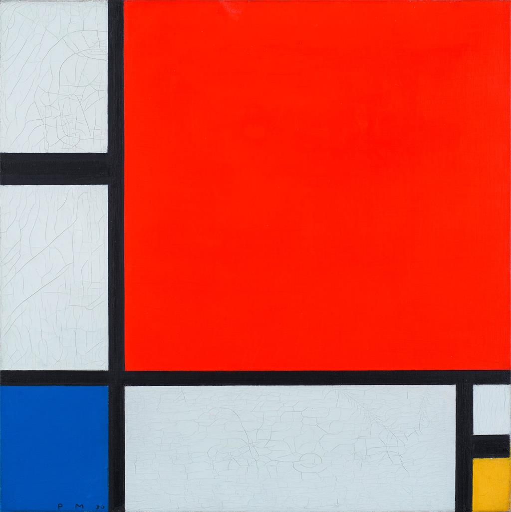

+++
title = 'Blender修改mesh为封闭模型'
date = 2026-05-15T09:00:00+08:00
draft = false
featured = false
tags = ['3D', 'Blender', '建模']
cover = 'cover.jpg'
cover_alt = 'Blender 视口模型'
cover_position = '50% 50%'
description = '在 3D 打印与物理仿真中，将破损网格缝合为非流形封闭几何体的实用技巧。'
+++

导入外部扫描模型或游戏提取资产时，经常会遇到破面、法线反转或非流形结构（Non-Manifold）。要将其送入切片软件或物理引擎，必须先修复为一个完全水密的封闭网格。

## 常见问题诊断

在编辑模式下，可以通过内置的检查工具快速定位问题边与顶点：

1. 进入 Edit Mode，全部取消选择（`Alt + A`）。
2. 使用快捷键 `Shift + Ctrl + Alt + M` 选取所有非流形几何元素。
3. 观察高亮区域，通常集中在边缘开孔或内部重叠面上。



## 实用修复流程

### 1. 移除重叠与多余顶点

先执行按距离合并，清理微小的重合点：

```text
Edit Mode -> Mesh -> Merge -> By Distance (快捷键 M -> By Distance)
```

### 2. 补洞与网格填充

对于开孔区域，优先使用 `Grid Fill` 而非单纯的 `F`（生成多边形），这样可以维持均匀的拓扑流向：

- 选中孔洞边缘环（`Alt + 单击边缘`）
- 按 `Ctrl + F` 调出 Face 菜单，选择 `Grid Fill`
- 调节 Offset 与 Span 参数，使新生成的四边面与原网格顺畅过渡。
